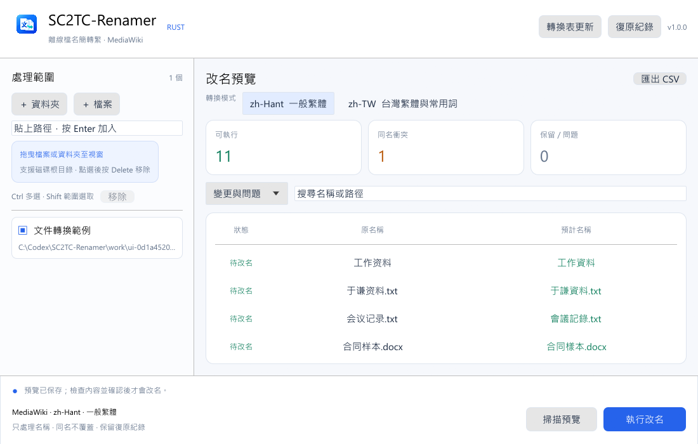
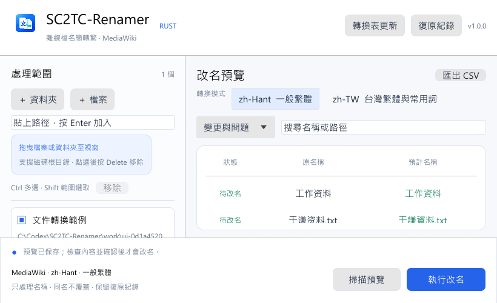

# SC2TC-Renamer

**Windows 檔案與資料夾名稱的簡體轉繁體工具。**

SC2TC-Renamer 以 Rust 開發，使用 MediaWiki 中文轉換表，提供一般繁體與台灣繁體兩種模式。透過掃描預覽、同名衝突檢查與逐筆復原紀錄，協助整理文件、影音及封存資料。日常轉換在本機離線完成，只調整名稱，保留檔案內容。



*介面依序呈現處理範圍、轉換模式、掃描摘要及名稱預覽；底部操作列在清單捲動時保持可見。截圖使用合成資料。*

## 主要功能

- **彈性選取範圍**：支援單一檔案、資料夾與磁碟根目錄；可從檔案總管拖入、按鈕選取或貼上路徑。
- **兩種繁體模式**：一般繁體 `zh-Hant`，以及含地區用詞的台灣繁體 `zh-TW`。
- **先預覽再套用**：比較原名稱與新名稱，搜尋或篩選清單，並匯出完整 CSV。
- **同名保護**：發現目標已存在或轉換後重複名稱時跳過，保留原項目。
- **可追蹤與復原**：保存原名稱、項目身分及逐筆操作狀態，支援中斷後查核與名稱復原。
- **手動轉換表更新**：取得正式發布的表快照，驗證後由使用者確認套用，亦可切回內附版本。

## 下載與啟動

從 [GitHub Releases](https://github.com/marvin3991/SC2TC-Renamer/releases) 下載 **`SC2TC-Renamer-v<版本>-portable.zip`**，解壓至任意有寫入權限的資料夾，再執行 `SC2TC-Renamer.exe`。執行程式不需安裝 Rust、Python 或 PHP。

| 附件 | 說明 |
|------|------|
| `SC2TC-Renamer-v<版本>-portable.zip` | Windows x64 執行檔、使用說明與授權文件 |
| `SC2TC-Renamer-v<版本>-source.zip` | 同版本完整對應原始碼，包含鎖定的第三方相依套件 |
| `SHA256SUMS.txt` | 下載附件與執行檔的 SHA-256 |
| `release-manifest.json` | 來源提交、版本、檔案大小與授權資訊 |
| `verification.json`、`source-verification.json` | 執行檔與離線來源包的發布前驗證結果 |

例如將 `v1.0.0` 解壓到 `C:\Tools\SC2TC-Renamer\`，執行檔位於 `C:\Tools\SC2TC-Renamer\SC2TC-Renamer-1.0.0-portable\SC2TC-Renamer.exe`。可用下列指令取得雜湊，再與附件 `SHA256SUMS.txt` 核對：

```powershell
chcp 65001 > $null
Get-FileHash -LiteralPath 'C:\Downloads\SC2TC-Renamer-v1.0.0-portable.zip' -Algorithm SHA256
```

本專案公開提供原始碼與 Release 附件，可直接從 Release 頁面下載。詳細下載指令及原始碼存放位置見 [建置與來源文件](docs/BUILD.md)。

## 使用方式

1. **加入路徑**：拖入檔案、資料夾或磁碟根目錄，也可使用選取按鈕或貼上路徑。資料夾會遞迴掃描；選取的資料夾本身保留原名。
2. **選擇模式**：依需求使用 `zh-Hant` 或 `zh-TW`，按「掃描預覽」。掃描階段保存名稱備份，不執行改名。
3. **核對結果**：檢查原名稱、新名稱與衝突。人名、地名及作品名稱請逐一確認；必要時匯出 CSV 查閱完整結果。
4. **執行改名**：按「執行改名」，閱讀確認內容後套用。搜尋與篩選只改變畫面顯示，實際執行範圍仍是完整預覽中的可執行項目。
5. **需要時復原**：按「復原紀錄」，選擇該次 `plan.json`，檢查後確認復原名稱。

| 清單操作 | 行為 |
|----------|------|
| 點選後按 `Delete` | 移除清單中的路徑，不刪除檔案 |
| `Ctrl`＋點選 | 多選路徑 |
| `Shift`＋點選 | 選取連續範圍 |
| `Ctrl+A` | 路徑清單全選 |

### 模式差異

| 模式 | 適用情境 | 轉換範例 |
|------|----------|----------|
| `zh-Hant`（預設） | 保留一般繁體用詞 | 软件 → 軟件；数据库 → 數據庫 |
| `zh-TW` | 採用台灣常見用詞 | 软件 → 軟體；数据库 → 資料庫；鼠标 → 滑鼠 |

切換模式或套用轉換表更新後，需重新掃描。短檔名可能缺乏判斷語意的上下文；目前測試中的 `岳飞`／`岳飛`皆轉為或保留 `岳飛`，但轉換表無法保證所有專有名詞都正確。

### 視窗與預覽



*最小版面採 `820 × 500` 邏輯點；路徑與預覽清單獨立捲動，掃描與執行按鈕保持可見。實際視窗大小會依螢幕可用空間與 DPI 調整。*

## 安全與復原

| 項目 | 處理方式 |
|------|----------|
| 同名或已存在的目標 | 跳過，保留原項目，不覆蓋、不自動加序號 |
| 檔案副檔名 | 保留最後一段副檔名 |
| 隱藏／系統項目、連結與接合點 | 排除；包含排除或無法讀取子樹的上層資料夾也保留名稱 |
| 預覽後內容或範圍改變 | 核對項目身分、大小及修改時間；不符即停止 |
| 改名或復原時遇到權限不足、檔案鎖定、磁碟離線 | 停止並保留執行紀錄，供查核與復原 |
| 操作順序 | 先處理深層名稱，再處理上層；復原採相反順序 |

紀錄存放於 `%LOCALAPPDATA%\SC2TC-Renamer\history\`，每次作業包含 `plan.json`、`preview.csv` 與 `events.jsonl`。復原使用原始紀錄位置，可手動選取既有的名稱備份；已完成的復原不會重複執行。

**名稱備份不包含文件內容。** 大量作業前請備份重要資料，改名與復原期間暫停其他程式修改同一範圍。原名稱遭占用、項目身分不符或檔案已修改時，工具會停止自動復原；資料夾修改時間不在還原範圍內。

## 更新轉換表

依序選擇「轉換表更新」→「檢查版本更新」→「下載並驗證」→「確認套用」。程式追蹤 crates.io 上 `zhconv` 的正式版本，取得其 MediaWiki 轉換表快照；下載與套用分開，驗證失敗或網路中斷時繼續使用目前版本。

更新檔與事件紀錄存放於 `%LOCALAPPDATA%\SC2TC-Renamer\mediawiki-dictionaries\`。套用前會備份設定，保留原始下載包、授權與來源資訊。「回復內附轉換表」可離線切回隨程式提供的資料。日常掃描不連線；手動更新不會上傳檔案名稱或內容。

轉換引擎固定為 `zhconv 0.4.2`，僅載入相容格式的表資料；遇到不相容的上游變更時，需要更新程式版本。

## 原始來源與開發

| 元件 | 原始連結 | 原始碼／下載檔存放位置 |
|------|----------|------------------------|
| SC2TC-Renamer | [專案 repo](https://github.com/marvin3991/SC2TC-Renamer) | 本機專案可放 `C:\Codex\SC2TC-Renamer\`；完整來源包內為 `SC2TC-Renamer-<版本>-source\` |
| zhconv `0.4.2` | [上游 repo](https://github.com/Gowee/zhconv-rs)、[正式 crate](https://static.crates.io/crates/zhconv/zhconv-0.4.2.crate) | 原檔可另存 `downloads\upstream\zhconv-0.4.2.crate`；完整來源包內為 `vendor\rust\zhconv-0.4.2\` |
| MediaWiki 轉換表 | [固定提交原始檔](https://raw.githubusercontent.com/wikimedia/mediawiki/ecf4342132cf089ac0c42436827e9038a738bb6f/includes/Languages/Data/ZhConversion.php) | 完整來源包內為 `vendor\mediawiki\ZhConversion.php`，及鎖定 crate 的 `data\ZhConversion.php` |
| MediaWiki 表生成器與原始資料 | [同提交的 zhtable 目錄](https://github.com/wikimedia/mediawiki/tree/ecf4342132cf089ac0c42436827e9038a738bb6f/maintenance/language/zhtable) | `vendor\mediawiki\upstream-source\maintenance\language\zhtable\` |

原始來源的版本與雜湊見 [來源清單](vendor/mediawiki/manifest.json)。自行下載的上游檔案可供查閱及比對；套用轉換表請使用程式內的更新流程。

開發使用 Rust／MSVC 與 Windows SDK；已驗證工具鏈為 Rust `1.98.0`。介面採 eframe／egui `0.33.3`，原生選取視窗採 rfd `0.17.2`。相依版本鎖定於 `Cargo.lock`；建置、測試與離線重建指令見 [docs/BUILD.md](docs/BUILD.md)。

## 授權

本專案自有程式碼採 [Apache License 2.0](LICENSE)。整體執行檔包含 MediaWiki 的 `GPL-2.0-or-later` 轉換表，依 [GNU GPL 第 3 版](COPYING)散布，第三方元件保留各自授權。

每個執行檔版本均須搭配同版本完整對應原始碼附件與授權文件；GitHub 自動生成的 `Source code.zip`／`.tar.gz` 不含打包時取得的完整相依來源，請使用本專案提供的 `*-source.zip`。再次交付執行檔時，也須一併提供該來源包與授權文件。詳見 [第三方授權聲明](THIRD_PARTY_NOTICES.md)及 [NOTICE](NOTICE)。

本專案為獨立工具，名稱與圖標不代表 MediaWiki 或 zhconv 官方背書。
